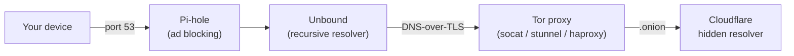

<h1 align="center">
  <a href="https://github.com/sureserverman/nice-dns">
    <!-- Please provide path to your logo here -->
    
  </a>
</h1>

<div align="center">
  nice-dns
  <br />
  <a href="#about"><strong>See how it works »</strong></a>
  <br />
  <br />
  <a href="https://github.com/sureserverman/nice-dns/issues/new?assignees=&labels=bug&template=01_BUG_REPORT.md&title=bug%3A+">Report a Bug</a>
  ·
  <a href="https://github.com/sureserverman/nice-dns/issues/new?assignees=&labels=enhancement&template=02_FEATURE_REQUEST.md&title=feat%3A+">Request a Feature</a>
  ·
  <a href="https://github.com/sureserverman/nice-dns/issues/new?assignees=&labels=question&template=04_SUPPORT_QUESTION.md&title=support%3A+">Ask a Question</a>
</div>

<div align="center">
<br />

[](LICENSE)

[](https://github.com/sureserverman/nice-dns/issues?q=is%3Aissue+is%3Aopen+label%3A%22help+wanted%22)
[](https://github.com/sureserverman)

</div>

<details open="open">
<summary>Table of Contents</summary>

- [About](#about)
- [Usage](#usage)
  - [Prerequisites](#prerequisites)
  - [Debian / Ubuntu](#debian--ubuntu)
  - [macOS](#macos)
  - [Installing from the dev branch](#installing-from-the-dev-branch)
  - [Re-running the installer](#re-running-the-installer)
  - [Configuration](#configuration)
  - [Pi-hole web interface](#pi-hole-web-interface)
  - [Notes](#notes)
- [Uninstall](#uninstall)
- [Roadmap](#roadmap)
- [Project assistance](#project-assistance)
- [Authors & contributors](#authors--contributors)
- [Security](#security)
- [License](#license)

</details>

---

## About

Podman Compose files and all necessary configuration to build a multi-container
DNS stack with Pi-hole, Unbound and a Tor proxy chained together:

All DNS queries leaving your machine are encrypted and routed through Tor.



## Usage

There are three proxy variants to choose from:

| Variant | Proxy container | How it works |
|---------|----------------|--------------|
| **tor-socat** (default) | `sureserver/tor-socat` | socat TCP relay through Tor |
| **tor-stunnel** | `sureserver/tor-stunnel` | stunnel TCP relay through Tor |
| **tor-haproxy** | `sureserver/tor-haproxy` | haproxy TCP relay through Tor |

### Prerequisites

- **Debian / Ubuntu**: `curl` (to run the one-liner)
- **macOS**: `curl` and [Homebrew](https://brew.sh/)

All other dependencies (`git`, `podman`, `podman-compose`) are installed
automatically by the scripts.

### Debian / Ubuntu

Install with a one-liner (run **without** `sudo`):

```bash
# tor-socat (default)
bash -x <(curl -sL https://raw.githubusercontent.com/sureserverman/nice-dns/main/install-deb.sh)

# tor-stunnel
bash -x <(curl -sL https://raw.githubusercontent.com/sureserverman/nice-dns/main/install-deb-stunnel.sh)

# tor-haproxy
bash -x <(curl -sL https://raw.githubusercontent.com/sureserverman/nice-dns/main/install-deb-haproxy.sh)
```

### macOS

Homebrew must be installed before running the script. If it is not found the
script will exit with instructions.

```bash
# tor-socat (default)
bash -x <(curl -sL https://raw.githubusercontent.com/sureserverman/nice-dns/main/install-mac.sh)

# tor-stunnel
bash -x <(curl -sL https://raw.githubusercontent.com/sureserverman/nice-dns/main/install-mac-stunnel.sh)

# tor-haproxy
bash -x <(curl -sL https://raw.githubusercontent.com/sureserverman/nice-dns/main/install-mac-haproxy.sh)
```

### Installing from the dev branch

To install from the `dev` branch, replace `main` with `dev` in the URL and pass `dev` as an argument:

```bash
# Debian / Ubuntu
bash -x <(curl -sL https://raw.githubusercontent.com/sureserverman/nice-dns/dev/install-deb.sh) dev

# macOS
bash -x <(curl -sL https://raw.githubusercontent.com/sureserverman/nice-dns/dev/install-mac.sh) dev
```

### Re-running the installer

Running the install script again will **remove all existing nice-dns
containers, images and the `dnsnet` network** before performing a fresh
install. This is the intended upgrade path.

### Configuration

The `.env` file in the repository root sets the Pi-hole web interface port:

| Variable | Default | Description |
|----------|---------|-------------|
| `WEBPORT` | `8880` | Host port mapped to the Pi-hole web UI |

### Pi-hole web interface

After installation, the Pi-hole admin dashboard is available at:

```
http://localhost:8880/admin
```

If you changed `WEBPORT` in `.env`, replace `8880` with your custom port.

### Notes

The scripts use `sudo` internally when needed and must be executed as your
regular user so that rootless Podman and user-mode systemd work correctly.

## Uninstall

To remove nice-dns, stop and delete the containers, images and network:

```bash
for name in tor-socat tor-stunnel tor-haproxy unbound pi-hole; do
  podman rm -f "$name" 2>/dev/null || true
  podman image rm -f "$name" 2>/dev/null || true
done
podman network rm dnsnet 2>/dev/null || true
```

On **Debian / Ubuntu** also remove the systemd services:

```bash
systemctl --user disable --now persistent-containers.service
sudo systemctl disable --now custom-dns-deb.service
```

On **macOS** also unload the launch agent and restore DNS:

```bash
launchctl unload ~/Library/LaunchAgents/org.startpodman.plist
```

Then reset your DNS servers to their original values (or "Empty" for DHCP)
using **System Settings > Network** or:

```bash
networksetup -listallnetworkservices | sed '1d' | grep -v '^\*' | while read -r svc; do
  sudo networksetup -setdnsservers "$svc" Empty
done
```

## Roadmap

See the [open issues](https://github.com/sureserverman/nice-dns/issues) for a list of proposed features (and known issues).

- [Top Feature Requests](https://github.com/sureserverman/nice-dns/issues?q=label%3Aenhancement+is%3Aopen+sort%3Areactions-%2B1-desc) (Add your votes using the 👍 reaction)
- [Top Bugs](https://github.com/sureserverman/nice-dns/issues?q=is%3Aissue+is%3Aopen+label%3Abug+sort%3Areactions-%2B1-desc) (Add your votes using the 👍 reaction)
- [Newest Bugs](https://github.com/sureserverman/nice-dns/issues?q=is%3Aopen+is%3Aissue+label%3Abug)

## Project assistance

If you want to say **thank you** or/and support active development of nice-dns:

- Add a [GitHub Star](https://github.com/sureserverman/nice-dns) to the project.
- Tweet about the nice-dns.
- Write interesting articles about the project on [Dev.to](https://dev.to/), [Medium](https://medium.com/) or your personal blog.

Together, we can make nice-dns **better**!

## Authors & contributors

The original setup of this repository is by [Serverman](https://github.com/sureserverman).

For a full list of all authors and contributors, see [the contributors page](https://github.com/sureserverman/nice-dns/contributors).

## Security

nice-dns follows good practices of security, but 100% security cannot be assured.
nice-dns is provided **"as is"** without any **warranty**. Use at your own risk.

## License

This project is licensed under the **GPLv3 license**.

See [LICENSE](LICENSE.md) for more information.
