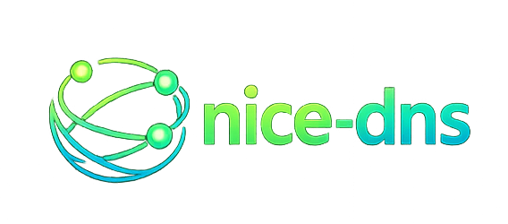
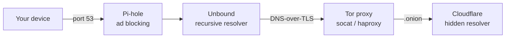

<h1 align="center">
  <br>
  nice-dns
</h1>

<p align="center">
  <strong>DNS that never leaves your machine in plaintext.</strong><br>
  Pi-hole → Unbound → Tor → Cloudflare's hidden resolver.
</p>

<p align="center">
  <a href="LICENSE.md"></a>
  <a href="https://github.com/sureserverman/nice-dns/issues"></a>
</p>

---

Your ISP sees encrypted Tor traffic — nothing else.

## Install

Run as a **regular user** (no `sudo`). macOS needs macOS 26+ on Apple silicon and [Homebrew](https://brew.sh/).

```bash
# Debian / Ubuntu
bash <(curl -sL https://raw.githubusercontent.com/sureserverman/nice-dns/main/install-deb.sh)

# macOS
bash <(curl -sL https://raw.githubusercontent.com/sureserverman/nice-dns/main/install-mac.sh)
```

Re-running the installer tears down the existing stack and recreates it cleanly.

### Arguments

```
install-{deb,mac}.sh [haproxy|socat|uninstall] [branch]
```

| Arg | Meaning |
|-----|---------|
| `haproxy` *(default)* | Tor proxy via HAProxy — `sureserver/tor-haproxy` |
| `socat` | Tor proxy via socat — `sureserver/tor-socat`, lighter |
| `branch` | Git branch to install from (default `main`) |

Example: `... install-deb.sh socat dev`

## Verify

```bash
dig @127.0.0.1 cloudflare.com        # Linux
dig @172.31.240.250 cloudflare.com   # macOS
```

Pi-hole admin UI:

| OS | URL |
|----|-----|
| Linux | <http://localhost:8880/admin> |
| macOS | <http://172.31.240.250/admin> |

## How it works


```mermaid
flowchart LR
    A[Your device] -- port 53 --> B[Pi-hole<br>ad blocking]
    B --> C[Unbound<br>recursive resolver]
    C -- DNS-over-TLS --> D[Tor proxy<br>socat / haproxy]
    D -- .onion --> E[Cloudflare<br>hidden resolver]
```

Three containers share the `dnsnet` bridge (`172.31.240.248/29`):

| Container | IP | Role |
|-----------|----|------|
| Pi-hole | `172.31.240.250` | Ad-blocking DNS on port 53; upstream is Unbound |
| Unbound | `172.31.240.251` | Recursive resolver; DoT upstream to the Tor proxy |
| Tor proxy | `172.31.240.252` | Tunnels DoT through Tor to Cloudflare's `.onion` |

Linux orchestrates the stack with rootless Podman quadlets (user-mode systemd). macOS drives Apple's `container` runtime from a login-triggered LaunchAgent.

## Uninstall

```bash
bash <(curl -sL https://raw.githubusercontent.com/sureserverman/nice-dns/main/install-deb.sh) uninstall
bash <(curl -sL https://raw.githubusercontent.com/sureserverman/nice-dns/main/install-mac.sh) uninstall
```

Removes quadlets/LaunchAgent, containers, images, the network, and restores system DNS. Shared system tweaks (PPA pin, sysctl, AppArmor, Homebrew packages, Rosetta) are left in place.

## License

[GPLv3](LICENSE.md). Report issues [here](https://github.com/sureserverman/nice-dns/issues).
