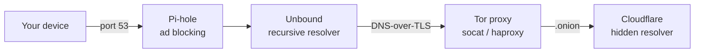

<h1 align="center">
  <br>
  nice-dns
</h1>

<p align="center">
  Multi-container DNS stack that routes every query through Tor.<br>
  <strong>Pi-hole → Unbound → Tor → Cloudflare's hidden resolver.</strong>
</p>

<p align="center">
  <a href="LICENSE.md"></a>
  <a href="https://github.com/sureserverman/nice-dns/issues"></a>
</p>

---

## Quick start

Run as a **regular user** (not `sudo`). On macOS install [Homebrew](https://brew.sh/) first.

```bash
# Debian / Ubuntu — tor-haproxy (default)
bash <(curl -sL https://raw.githubusercontent.com/sureserverman/nice-dns/main/install-deb.sh)

# macOS (requires macOS 26+ on Apple silicon) — tor-haproxy (default)
bash <(curl -sL https://raw.githubusercontent.com/sureserverman/nice-dns/main/install-mac.sh)
```

For the `tor-socat` variant, swap the script name to `install-deb-socat.sh` or `install-mac-socat.sh`. Re-running any installer tears down the existing stack and reinstalls cleanly.

Pi-hole admin UI: <http://localhost:8880/admin>

## How it works


```mermaid
flowchart LR
    A[Your device] -- port 53 --> B[Pi-hole<br>ad blocking]
    B --> C[Unbound<br>recursive resolver]
    C -- DNS-over-TLS --> D[Tor proxy<br>socat / haproxy]
    D -- .onion --> E[Cloudflare<br>hidden resolver]
```

Three containers share the `dnsnet` bridge (`172.31.240.248/29`). Linux drives them with rootless Podman; macOS uses Apple's `container` runtime. All external DNS traffic is DNS-over-TLS inside Tor — your ISP only sees encrypted Tor traffic.

| Variant | Proxy image | Relay |
|---------|-------------|-------|
| `tor-haproxy` (default) | `sureserver/tor-haproxy` | haproxy TCP |
| `tor-socat` | `sureserver/tor-socat` | socat TCP |

## Configuration

Set the Pi-hole web UI port via `.env` (default `8880`):

```ini
WEBPORT=8880
```

<details>
<summary>Install from the <code>dev</code> branch</summary>

```bash
bash <(curl -sL https://raw.githubusercontent.com/sureserverman/nice-dns/dev/install-deb.sh) dev
bash <(curl -sL https://raw.githubusercontent.com/sureserverman/nice-dns/dev/install-mac.sh) dev
```
</details>

<details>
<summary>Refresh macOS sudoers manually</summary>

`./mac/persist.sh` does this automatically during install. To redo it by hand:

```bash
sed "s/__USERNAME__/$(whoami)/" ./mac/start-container.sudoers \
  | sudo tee /etc/sudoers.d/start-container >/dev/null
sudo chmod 440 /etc/sudoers.d/start-container
sudo visudo -cf /etc/sudoers.d/start-container
```
</details>

## Uninstall

<details>
<summary>Debian / Ubuntu</summary>

```bash
systemctl --user disable --now persistent-containers.service
sudo systemctl disable --now custom-dns-deb.service
for name in tor-socat tor-haproxy unbound pi-hole; do
  podman rm -f "$name" 2>/dev/null || true
  podman image rm -f "$name" 2>/dev/null || true
done
podman network rm dnsnet 2>/dev/null || true
```
</details>

<details>
<summary>macOS</summary>

```bash
launchctl unload ~/Library/LaunchAgents/org.nice-dns.start-container.plist
rm -f ~/Library/LaunchAgents/org.nice-dns.start-container.plist
sudo rm -f /etc/sudoers.d/start-container /usr/local/sbin/start-container*.sh
for name in tor-socat tor-haproxy unbound pi-hole; do
  container stop "$name" 2>/dev/null || true
  container rm   "$name" 2>/dev/null || true
done
container network rm dnsnet 2>/dev/null || true

# restore DNS to DHCP defaults
networksetup -listallnetworkservices | sed '1d' | grep -v '^\*' \
  | while read -r svc; do sudo networksetup -setdnsservers "$svc" Empty; done
```
</details>

## License

[GPLv3](LICENSE.md) — provided **"as is"**, without warranty. Report issues [here](https://github.com/sureserverman/nice-dns/issues).
