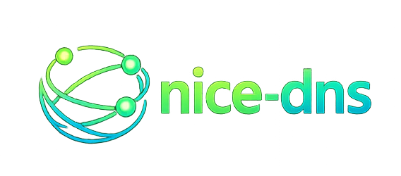
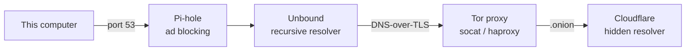

<h1 align="center">
  <br>
  nice-dns
</h1>

<p align="center">
  <strong>DNS that never leaves your machine in plaintext.</strong><br>
  Pi-hole → Unbound → Tor → Cloudflare's hidden resolver.
</p>

<p align="center">
  <a href="LICENSE.md"></a>
  <a href="https://github.com/sureserverman/nice-dns/issues"></a>
</p>

---

Your ISP sees encrypted Tor traffic — nothing else.

## Install

Run as a **regular user** (no `sudo`). macOS needs macOS 26+ on Apple silicon and [Homebrew](https://brew.sh/).

```bash
# Debian / Ubuntu
bash <(curl -sL https://raw.githubusercontent.com/sureserverman/nice-dns/main/install-deb.sh)

# macOS
bash <(curl -sL https://raw.githubusercontent.com/sureserverman/nice-dns/main/install-mac.sh)
```

Re-running the installer tears down the existing stack and recreates it cleanly.

### Arguments

```
install-{deb,mac}.sh [haproxy|socat|uninstall] [branch]
```

| Arg | Meaning |
|-----|---------|
| `haproxy` *(default)* | Tor proxy via HAProxy — `sureserver/tor-haproxy` |
| `socat` | Tor proxy via socat — `sureserver/tor-socat`, lighter |
| `branch` | Git branch to install from (default `main`) |

Example: `... install-deb.sh socat dev`

## Verify

```bash
dig @127.0.0.1 cloudflare.com        # Linux
dig @172.31.240.250 cloudflare.com   # macOS
```

Pi-hole admin UI:

| OS | URL |
|----|-----|
| Linux | <http://localhost:8880/admin> |
| macOS | <http://172.31.240.250/admin> |

The admin password is generated once per install and kept across reinstalls.
It is never printed. Read it with:

```bash
cat ~/.local/state/nice-dns/secrets/pihole/pihole_webpassword
```

To choose your own, write it to that file (one line, mode `600`) and run the
installer again. The uninstall deletes it.

What you change in the admin UI's lists survives restarts, reinstalls,
upgrades and a switch between the standard and hardened installers: allowed
and denied domains, regex rules, groups, clients and blocklists you added
(with the domains they last downloaded). Pi-hole's other settings come from
nice-dns's own configuration on every install. Tor's state and Unbound's
root trust anchor are kept the same way, so a restart does not bootstrap Tor
from nothing. The uninstall removes all of it.

## How it works


```mermaid
flowchart LR
    A[This computer] -- port 53 --> B[Pi-hole<br>ad blocking]
    B --> C[Unbound<br>recursive resolver]
    C -- DNS-over-TLS --> D[Tor proxy<br>socat / haproxy]
    D -- .onion --> E[Cloudflare<br>hidden resolver]
```

Linux runs the stack as a rootless Podman pod managed by user-mode systemd
quadlets. The pod publishes DNS on `127.0.0.1:53` and the Pi-hole UI on
`127.0.0.1:8880`, so only this computer can use them, not other devices on
its network. Inside the pod, the services share a network namespace and talk
over localhost:

| Service | Pod-local endpoint | Role |
|---------|--------------------|------|
| Pi-hole | `127.0.0.1:53` | Ad-blocking DNS; upstream is Unbound |
| Unbound | `127.0.0.1:5335` | Recursive resolver; DoT upstream to the Tor proxy |
| Tor proxy | `127.0.0.1:853` | Tunnels DoT through Tor to Cloudflare's `.onion` |

macOS drives Apple's `container` runtime from a login-triggered LaunchAgent and
keeps Pi-hole reachable at `172.31.240.250`.

## Uninstall

```bash
bash <(curl -sL https://raw.githubusercontent.com/sureserverman/nice-dns/main/install-deb.sh) uninstall
bash <(curl -sL https://raw.githubusercontent.com/sureserverman/nice-dns/main/install-mac.sh) uninstall
```

Removes quadlets/LaunchAgent, pods, containers, images, the network, and restores system DNS. Shared system tweaks (PPA pin, sysctl, AppArmor, Homebrew packages, Rosetta) are left in place.

## License

[GPLv3](LICENSE.md). Report issues [here](https://github.com/sureserverman/nice-dns/issues).
